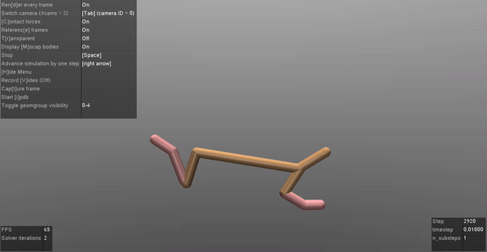

# MuJoCo HalfCheetah-v2

The repository contains two reinforcement learning algorithm which solve the MuJoCo continuous control tasks with special attention to the HalfCheetah-v2 environment. Using the minimal CLI, experiments can be run to test the performance of our implementation of the Monte Carlo Policy Gradient and Deep Deterministic Policy Gradient algorithms. Furthermore, simulations can be run which illustrate the performance of our trained models.



## installation
Install the necessary packages using:
```
pip install -r requirements.txt
```
In order to run the MuJoCo environments, a license is need. Information on how to install `mujoco_py` and obtain a license can be found [here](https://spinningup.openai.com/en/latest/user/installation.html#installing-mujoco-optional).

## Usage
All experiments can be run using:
```
python main.py -r all
```

**Note:**  The experiments can tak up several hours.

With the following command, 5 episodes of the HalfCheetah-v2 environment will be simulated
```
python main.py --simulate --episodes 5
```
All options can be displayed using:
```
python main.py --help
```
## acknowledgements
We had help from some very good blogs and code examples. Below a list of the most helpful ones.

- https://spinningup.openai.com/en/latest/algorithms/ddpg.html
- https://github.com/cookbenjamin/DDPG
- https://keras.io/examples/rl/ddpg_pendulum/
- https://yanpanlau.github.io/2016/10/11/Torcs-Keras.html
- https://medium.com/@dey.ritajit/learning-cart-pole-and-lunar-lander-through-reinforce-9191fa21decc
- https://medium.com/@dey.ritajit/learning-cart-pole-and-lunar-lander-through-reinforce-9191fa21decc
